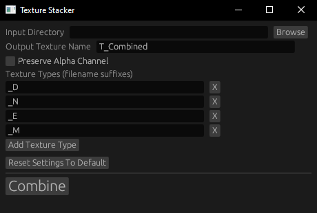

## Texture Stacker

A tool to combine multiple texture sets from Substance Painter into a single texture set. It requires alpha channels in the diffuse textures as they are used as masks.

Drag and drop a folder containing all sets to and press Combine.

